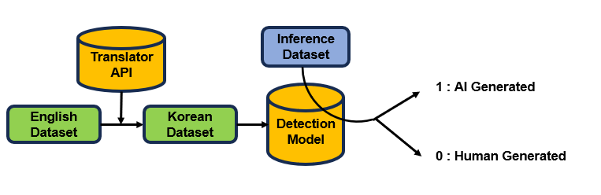

# 한국어 LLM Text Generation 유사 탐지 모델 개발

## Introduction

한국어에 대해서 LLM 으로 부터 generated 되었는지, Human generated 
되었는지 탐지하는 모델을 개발

## Motivation

- 한국어 LLM 탐지 연구기여 
- 한국어 데이터셋 생성기여

## Models and Methods

### 1. Supervised Learning
- **Models Used:**
  - [Mistral 7B-ko](https://huggingface.co/maywell/Mistral-ko-7B-v0.1) with Lora Fine Tuning
- **[Ghost Buster](https://arxiv.org/abs/2305.15047):**
  - LightGBM (0.45)
  - Multinomial Naive Bayes (0.45)
  - SGD Classifier (0.1)

### 2. Unsupervised Learning
- **Weak Labeling Approach:**
  - Thresholds set for human-generated scores (>0.8) and AI-generated scores (<0.2)

### 3. Zero-Shot Inference
- **Models Utilized:**
  - GPT 3.5, GPT 4, GPT 4o
  - Google Gemini 1.0 Pro

## Train Dataset

The project utilizes a [Google translator API](https://cloud.google.com/translate/docs/reference/rest) to create a bilingual dataset: [DAIGT DataSet](https://www.kaggle.com/datasets/thedrcat/daigt-v2-train-dataset)
- **Source:** English dataset
- **Target:** Translated Korean dataset

## Inference Dataset

We made ourselves by collecting..
- [university entrance exams](https://www.kaggle.com/datasets/umgeeyo/korean-essay) in Korea, specifically in the humanities and social sciences

    - Human Generated :  인문논술 모범답안
    - LLM Generated   :  GPT Generated
    

## Results

Performance metrics for the models are as follows:
- **Supervised Learning:** Best ROC-AUC of 0.98 with Mistral 7B and F1 score of 0.92 with Ghost Buster.
- **Unsupervised Learning:** Best ROC-AUC of 0.96 with Mistral 7B and F1 score of 0.91.
- **Zero-Shot Learning:** Stable performance across different versions of GPT with an F1 score around 0.85.

## Conclusion

Our results demonstrate the feasibility of using advanced machine learning techniques for distinguishing between human and AI-generated texts in Korean. Ongoing improvements and expansions of the dataset will further enhance the model's accuracy and reliability.

## Model Performance Metrics

| Category    | Metric   | Test  | Ghost Buster | Mistral 7B | Gemini | GPT 3.5 | GPT 4 | GPT 4o |
|-------------|----------|-------|--------------|------------|--------|---------|-------|--------|
| Supervised  | ROC-AUC  | 0.91  | 0.98         | 0.98       | -   | -   |  -   |  -     |
|             | F1       | 0.89  | 0.92         | 0.92       | -   | -   | -   | -     |
| Unsupervised| ROC-AUC  | 0.95  | 0.96         | 0.96       | 0.38   | 0.54    | 0.45  | 0.40   |
|             | F1       | 0.90  | 0.91         | 0.91       | 0.80   | 0.82    | 0.85  | 0.85   |
| Zero shot   | ROC-AUC  | -     | -            | -          | 0.46   | 0.53    | 0.58  | 0.45   |
|             | F1       | -     | -            | -          | 0.78   | 0.85    | 0.85  | 0.85   |